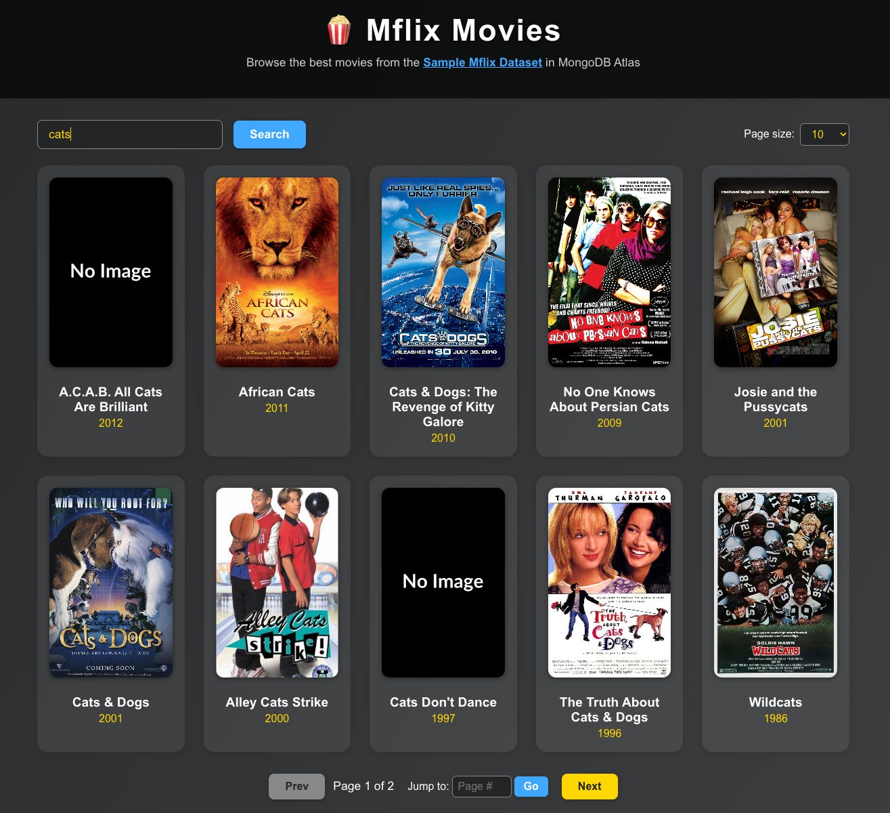

# Mflix Movies App

An interactive movie browser built with React, Node.js, and MongoDB, featuring the [MongoDB Sample Mflix Dataset](https://www.mongodb.com/docs/atlas/sample-data/sample-mflix/).



## Purpose

This project can be used during a technical interview to assess the JavaScript/TypeScript programming capabilities of a candidate. Successful completion of the assessment would result in a web application that can interact with a [MongoDB Atlas](https://www.mongodb.com/cloud/atlas) cluster that has been pre-loaded with the [`sample_mflix` dataset](https://www.mongodb.com/docs/atlas/sample-data/sample-mflix/).

>[!NOTE]
> During the assessment, the candidate should work through the following, while describing their thought process and demonstrating their ability to navigate and make sense of a foreign codebase:
> * Clone the repository
> * Install dependencies, configure the solution, start all processes and try navigating to https://localhost:3000
> * Using the API only, access the 10th page of results with a page size of 25
> * Add a new API method to create a new movie (only the `title` and `year` need to be recorded). Demonstrate this works by creating a new movie and retrieving it via the appropriate APIs.
> * The page sizes of 10, 25, 50 and 100 seem like too many - remove 100 from the UI
> * Each movie contains an IMDB rating. Adapt the solution to enable filtering for movies with a rating greater than a given value, but less than 10:
>   * Update the UI to create a new component
>   * Update the main application to place the component
>   * Update the server to apply the ratings filter if present
>   * Validate the rating to ensure it is greater than 0 and less than or equal to 10
>   * Note that using the MongoDB Shell this might look like the following: `db.movies.find({ "imdb.rating": { $gte: 7.3 } })`

## Features

- Browse, search, and filter movies from the `sample_mflix` dataset
- Pagination with page size selection and jump-to-page
- Responsive movie grid with poster images
- Click a movie to view detailed info in a modal (plot, genres, cast, directors, ratings, awards, etc.)
- Backend API with search and pagination, powered by Express and MongoDB

## Getting Started

### Prerequisites
- Node.js (v18+ recommended)
- MongoDB Atlas account (or local MongoDB with the `sample_mflix` dataset)
- Basic understand of TypeScript, JavaScript, React, Express and some MongoDB (the [Node.js driver](https://www.mongodb.com/docs/drivers/node/current/) will be used, so the [API docs](https://mongodb.github.io/node-mongodb-native/6.17/) may be useful)

### Setup the Backend
1. Copy `.env.example` to `.env` in the `server/` folder and set your `MONGODB_URI`. For more information as to where to find this value see ["Find Your MongoDB Atlas Connection String"](https://www.mongodb.com/docs/manual/reference/connection-string/#find-your-mongodb-atlas-connection-string).
2. Install dependencies:
   ```bash
   cd server
   npm install
   ```
3. Start the server:
   ```bash
   npm start
   ```
   The API will run on [http://localhost:4000](http://localhost:4000) by default.

### Setup the Frontend
1. In a new terminal, go to the `app/` folder:
   ```bash
   cd ../app
   npm install
   ```

2. Start the React app (using Vite):
   ```bash
   npm run dev
   ```
   The app will run on [http://localhost:3000](http://localhost:3000).

### Proxy Setup
The React app is configured to proxy `/api` requests to the backend server. Make sure both servers are running.

## API Endpoints

- `GET /api/movies?page=1&limit=10&search=title` — List movies with pagination and optional title search

## License

Copyright 2025-present, Alex Bevilacqua

Permission is hereby granted, free of charge, to any person obtaining a copy of this software and associated documentation files (the “Software”), to deal in the Software without restriction, including without limitation the rights to use, copy, modify, merge, publish, distribute, sublicense, and/or sell copies of the Software, and to permit persons to whom the Software is furnished to do so, subject to the following conditions:

The above copyright notice and this permission notice shall be included in all copies or substantial portions of the Software.

THE SOFTWARE IS PROVIDED “AS IS”, WITHOUT WARRANTY OF ANY KIND, EXPRESS OR IMPLIED, INCLUDING BUT NOT LIMITED TO THE WARRANTIES OF MERCHANTABILITY, FITNESS FOR A PARTICULAR PURPOSE AND NONINFRINGEMENT. IN NO EVENT SHALL THE AUTHORS OR COPYRIGHT HOLDERS BE LIABLE FOR ANY CLAIM, DAMAGES OR OTHER LIABILITY, WHETHER IN AN ACTION OF CONTRACT, TORT OR OTHERWISE, ARISING FROM, OUT OF OR IN CONNECTION WITH THE SOFTWARE OR THE USE OR OTHER DEALINGS IN THE SOFTWARE.
